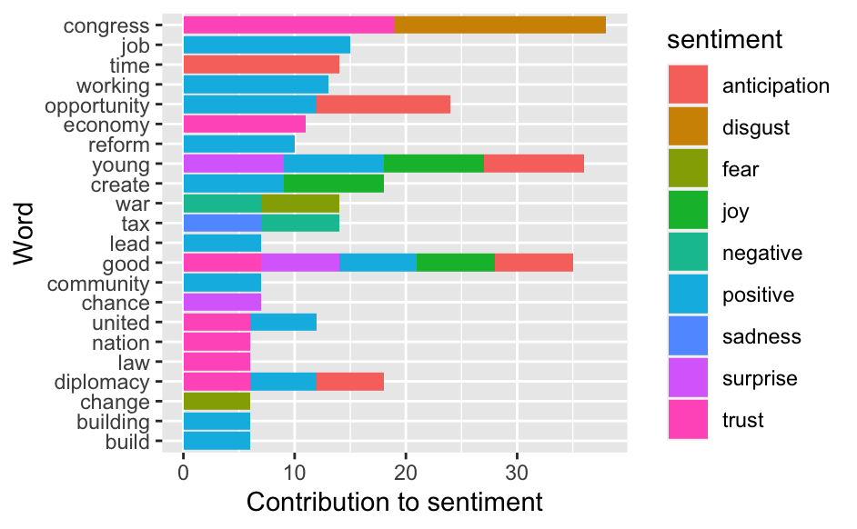

```{r, include=FALSE}
knitr::opts_chunk$set(
  results='asis', 
  echo = FALSE
)

library(glue)
library(tidyverse)

# Set this to true to have links turned into footnotes at the end of the document
PDF_EXPORT <- FALSE

# Holds all the links that were inserted for placement at the end
links <- c()

source('parsing_functions.R')

# Load csv with position info
position_data <- read_csv('positions.csv')
```


```{r}
# When in export mode the little dots are unaligned, so fix that. 
if(PDF_EXPORT){
  cat("
  <style>
  :root{
    --decorator-outer-offset-left: -6.5px;
  }
  </style>")
}
```


Aside
================================================================================


{width=100%}

```{r}
# When in export mode the little dots are unaligned, so fix that. 
if(PDF_EXPORT){
  cat("View this CV online with links at _nickstrayer.me/cv_")
} else {
  cat("[<i class='fas fa-download'></i> Download a PDF of this CV](https://github.com/nstrayer/cv/raw/master/strayer_cv.pdf)")
}
```

Contact {#contact}
--------------------------------------------------------------------------------


- <i class="fa fa-envelope"></i> keronnin@asu.edu
- <i class="fa fa-twitter"></i> kirsten_ronning
- <i class="fa fa-github"></i> github.com/kirstenronning
- <i class="fa fa-linkedin"></i> linkedin.com/in/kirstenronning/
- <i class="fa fa-phone"></i> (602) 826-1484


Language Skills {#skills}
--------------------------------------------------------------------------------

```{r}
skills <- tribble(
  ~skill,               ~level,
  "R",                  3,
  "Python",             2,
  "SQL",                2,
  "HTML5",              2,
)

build_skill_bars(skills)
```


Disclaimer {#disclaimer}
--------------------------------------------------------------------------------

Made with the R package [**pagedown**](https://github.com/rstudio/pagedown). 

The source code is available at [github.com/nstrayer/cv](https://github.com/nstrayer/cv).

Last updated on `r Sys.Date()`.


Main
================================================================================

Kirsten Ronning {#title}
--------------------------------------------------------------------------------


```{r}
intro_text <- "
Currently searching for a data science or program analyst position that allows me to build tools using visualization and machine learning to help people explore and understand their data. 
"

cat(sanitize_links(intro_text))
```


Education {data-icon=graduation-cap data-concise=true}
--------------------------------------------------------------------------------

::: aside
Graduated Summa Cum Laude
Awards: Dean's List, New American Presidential Scholarship, and Special Talent Award
:::

```{r}
print_section(position_data, 'education')
```


Professional Experience {data-icon=suitcase}
--------------------------------------------------------------------------------

::: aside
I have worked in a variety of roles. These have given me experience in management, customer service, working in teams, communication, collaboration, and more.  
:::

```{r}
print_section(position_data, 'industry_positions')
```

<br>
<br>
<br>

Capstone Projects {data-icon=book}
--------------------------------------------------------------------------------

```{r}
print_section(position_data, 'academic_articles')
```


Data Science Projects {data-icon=chart-line}
--------------------------------------------------------------------------------

```{r}
print_section(position_data, 'data_science_writings')
```


Volunteer/Organizations {data-icon=newspaper}
--------------------------------------------------------------------------------

```{r}
print_section(position_data, 'about_me_press')
```


```{r}
if(PDF_EXPORT){
  cat("
  
Links {data-icon=link}
--------------------------------------------------------------------------------

<br>


")
  
  walk2(links, 1:length(links), function(link, index){
    print(glue('{index}. {link}'))
  })
}
```


